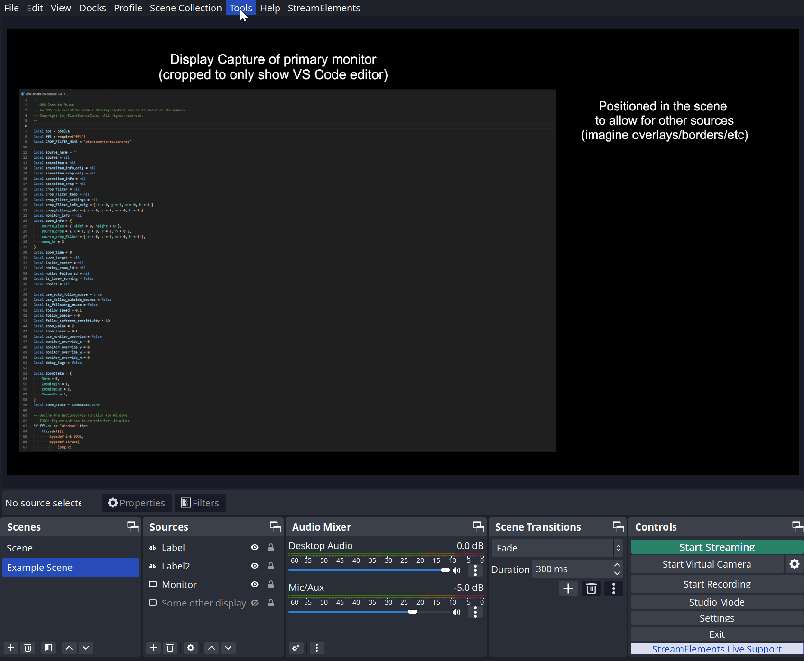

# OBS-Zoom-To-Mouse

An OBS lua script to zoom a display-capture source to focus on the mouse. 

I made this for my own use when recording videos as I wanted a way to zoom into my IDE when highlighting certain sections of code. My particular setup didn't seem to work very well with the existing zooming solutions so I created this.

Built with OBS v29.1.3

Now works on **Windows**, **Linux**, and **Mac**

Inspired by [tryptech](https://github.com/tryptech)'s [obs-zoom-and-follow](https://github.com/tryptech/obs-zoom-and-follow)

## Example

## Install
1. Git clone the repo (or just save a copy of `obs-zoom-to-mouse.lua`)
1. Launch OBS
1. In OBS, add a `Display Capture` source (if you don't have one already)
1. In OBS, open Tools -> Scripts
1. In the Scripts window, press the `+` button to add a new script
1. Find and add the `obs-zoom-to-mouse.lua` script
1. For best results use the following settings on your `Display Capture` source
   * Transform:
      * Positional Alignment - `Top Left`
      * Bounding Box type -  `Scale to inner bounds`
      * Alignment in Bounding Box - `Top Left`
      * Crop - All **zeros**
   * If you want to crop the display, add a new Filter -> `Crop/Pad`
      * Relative - `False`
      * X - Amount to crop from left side
      * Y - Amount to crop form top side
      * Width - Full width of display minus the value of X + amount to crop from right side
      * Height - Full height of display minus the value of Y + amount to crop from bottom side
   
   **Note:** If you don't use this form of setup for your display source (E.g. you have bounding box set to `No bounds` or you have a `Crop` set on the transform), the script will attempt to **automatically change your settings** to zoom compatible ones. 
   This may have undesired effects on your layout (or just not work at all).

   **Note:** If you change your desktop display properties in Windows (such as moving a monitor, changing your primary display, updating the orientation of a display), you will need to re-add your display capture source in OBS for it to update the values that the script uses for its auto calculations. You will then need to reload the script.

## Usage
1. You can customize the following settings in the OBS Scripts window:
   * **Zoom Source**: The display capture in the current scene to use for zooming
   * **Zoom Factor**: How much to zoom in by
   * **Zoom Speed**: The speed of the zoom in/out animation
   * **Follow outside bounds**: True to track the cursor even when it is outside the bounds of the source
   * **Follow Speed**: The speed at which the zoomed area will follow the mouse when tracking
   * **Show all sources**: True to allow selecting any source as the Zoom Source - Note: You **MUST** set manual source position for non-display capture sources
   * **Set manual source position**: True to override the calculated x/y (topleft position), width/height (size), and scaleX/scaleY (canvas scale factor) for the selected source. This is essentially the area of the desktop that the selected zoom source represents. Usually the script can calculate this, but if you are using a non-display capture source, or if the script gets it wrong, you can manually set the values.
   * **X**: The coordinate of the left most pixel of the source
   * **Y**: The coordinate of the top most pixel of the source
   * **Width**: The width of the source (in pixels)
   * **Height**: The height of the source (in pixels)
   * **Scale X**: The x scale factor to apply to the mouse position if the source is not 1:1 pixel size (normally left as 1, but useful for cloned sources that have been scaled)
   * **Scale Y**: The y scale factor to apply to the mouse position if the source is not 1:1 pixel size (normally left as 1, but useful for cloned sources that have been scaled)
   * **Monitor Width**: The width of the monitor that is showing the source (in pixels)
   * **Monitor Height**: The height of the monitor that is showing the source (in pixels)
   * **More Info**: Show this text in the script log
   * **Enable debug logging**: Show additional debug information in the script log

1. In OBS, open File -> Settings -> Hotkeys 
   * Add a hotkey for `Toggle zoom to mouse` to zoom in and out (mouse tracking is always active while zoomed in)

### Dual Machine Support
1. The script also has some **basic** dual machine setup support. By using my related project [obs-zoom-to-mouse-remote](https://github.com/BlankSourceCode/obs-zoom-to-mouse-remote) you will be able to track the mouse on your second machine
1. When you have [ljsocket.lua](https://github.com/BlankSourceCode/obs-zoom-to-mouse-remote) in the same directory as `obs-zoom-to-mouse.lua`, the following settings will also be available:
   * **Enable remote mouse listener**: True to start a UDP socket server that will listen for mouse position messages from a remote client
   * **Port**: The port number to use for the socket server
   * **Poll Delay**: The time between updating the mouse position (in milliseconds)
   * For more information see [obs-zoom-to-mouse-remote](https://github.com/BlankSourceCode/obs-zoom-to-mouse-remote)

### More information on how mouse tracking works
When you press the `Toggle zoom` hotkey the script will use the current mouse position as the center of the zoom. The script will then animate the width/height values of a crop/pan filter so it appears to zoom into that location. While zooming in, the mouse position is continuously tracked so the zoom follows your cursor during the animation.

Once zoomed in, the camera smoothly follows your mouse at the configured `Follow Speed`. Press the hotkey again to zoom back out. There is only one hotkey — zoom in and follow are always combined.

### More information on 'Show All Sources'
If you enable the `Show all sources` option, you will be able to select any OBS source as the `Zoom Source`. This includes **any** non-display capture items such as cloned sources, browsers, or windows (or even things like audio input - which really won't work!).

Selecting a non-display capture zoom source means the script will **not be able to automatically calculate the position and size of the source**, so zooming and tracking the mouse position will be wrong!

To fix this, you MUST manually enter the size and position of your selected zoom source by enabling the `Set manual source position` option and filling in the `X`, `Y`, `Width`, and `Height` values. These values are the pixel topleft position and pixel size of the source on your overall desktop. You may also need to set the `Scale X` and `Scale Y` values if you find that the mouse position is incorrectly offset when you zoom, which is due to the source being scaled differently than the monitor you are using.

Example 1 - A 500x300 window positioned at the center of a single 1000x900 monitor, would need the following values:
   * X = 250 (center of monitor X 500 - half width of window 250)
   * Y = 300 (center of monitor Y 450 - half height of window 150)
   * Width = 500 (window width)
   * Height = 300 (window height)

Example 2 - A cloned display-capture source which is using the second 1920x1080 monitor of a two monitor side by side setup:
   * X = 1921 (the left-most pixel position of the second monitor because it is immediately next to the other 1920 monitor)
   * Y = 0 (the top-most pixel position of the monitor)
   * Width = 1920 (monitor width)
   * Height = 1080 (monitor height)

Example 3 - A cloned scene source which is showing a 1920x1080 monitor but the scene canvas size is scaled down to 1024x768 setup:
   * X = 0 (the left-most pixel position of the monitor)
   * Y = 0 (the top-most pixel position of the monitor)
   * Width = 1920 (monitor width)
   * Height = 1080 (monitor height)
   * Scale X = 0.53 (canvas width 1024 / monitor width 1920)
   * Scale Y = 0.71 (canvas height 768 / monitor height 1080)

I don't know of an easy way of getting these values automatically otherwise I would just have the script do it for you.

Note: If you are also using a `transform crop` on the non-display capture source, you will need to manually convert it to a `Crop/Pad Filter` instead (the script has trouble trying to auto convert it for you for non-display sources).

## Known Limitations
* Only works on `Display Capture` sources (automatically)
   * In theory it should be able to work on window captures too, if there was a way to get the mouse position relative to that specific window
   * You can now enable the [`Show all sources`](#More-information-on-'Show-All-Sources') option to select a non-display capture source, but you MUST set manual source position values

* Using Linux:
   * You may need to install the [loopback package](https://obsproject.com/forum/threads/obs-no-display-screen-capture-option.156314/) to enable `XSHM` display capture sources. This source acts most like the ones used by Windows and Mac so the script can auto calculate sizes for you.
   * The script will also work with `Pipewire` sources, but you will need to enable `Allow any zoom source` and `Set manual source position` since the script cannot get the size by itself.

* Using Mac:
   * When using `Set manual source position` you may need to set the `Monitor Height` value as it is used to invert the Y coordinate of the mouse position so that it matches the values of Windows and Linux that the script expects.

## Development Setup
* Clone this repo
* Edit `obs-zoom-to-mouse.lua`
* Click `Reload Scripts` in the OBS Scripts window

##

Want to support me staying awake long enough to add some more features?

